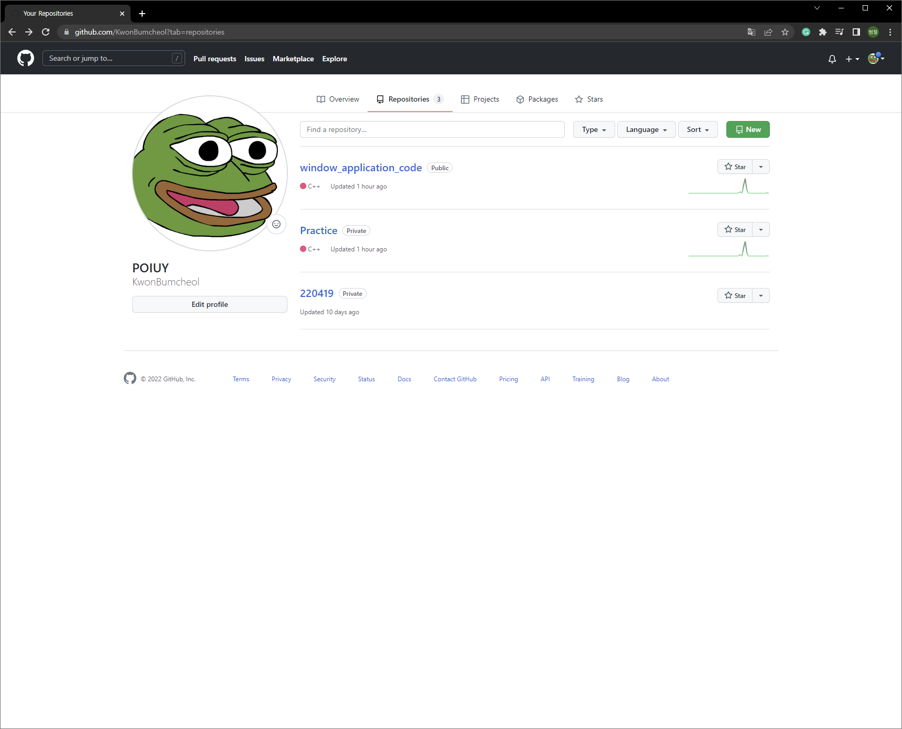

Github - VS Code Connection method
====

## URL Address
> <https://velog.io/@blair-lee/VSCode%EC%97%90%EC%84%9C-Github-%EC%97%85%EB%A1%9C%EB%93%9C%ED%95%98%EB%8A%94-%EB%B0%A9%EB%B2%95%EC%A7%B1%EC%89%AC%EC%9B%80%E3%85%8B%E3%85%8B>
> 
> <https://coding-factory.tistory.com/619>

### 1. Create New Repositroy in Github

Click "New" Button(Green)

Choose a name for the repository


### 2. Open VS Code
In Powershell

```
git remote add origin [repository_url]
```

> If!!! you see it > "Remote origin already exists"

```
git remote remove origin
git remote add origin [repository_url]
```

Lastly
```
git remote -v
```

+ Ctrl + S (Save)
+ Commit and Push

End
